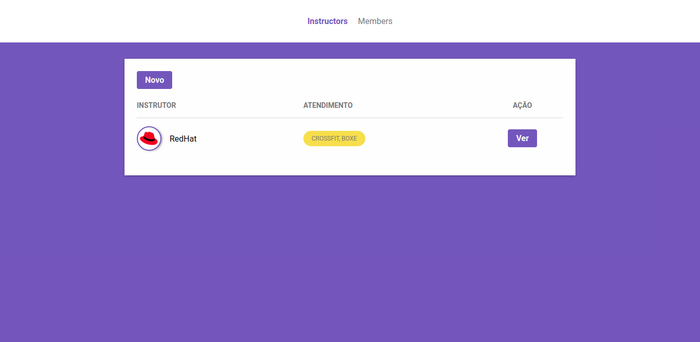

# GymManager

Projeto feito para estudo de NodeJs

## Apresentação 

O Gym Manager é um sistema responsavel pelo controle de instrutores e membros de uma academia.

    

### Funções do Gym Manager

- [x] Ver todos os instrutores cadastrados

- [x] Criar instrutores

- [x] Editar instrutores

- [x] Deletar instrutores

- [x] Ver todos os membros cadastrados

- [x] Criar membros

- [x] Editar membros

- [x] Deletar membros

### Tecnologias

* Html
* Css
* NodeJs
* Nunjucks
* PostgreSQL
* Express

Novas features vão sair ao longo do tempo.